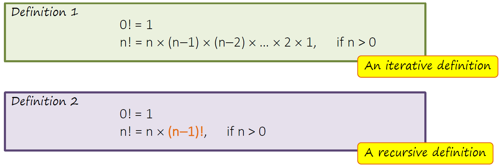
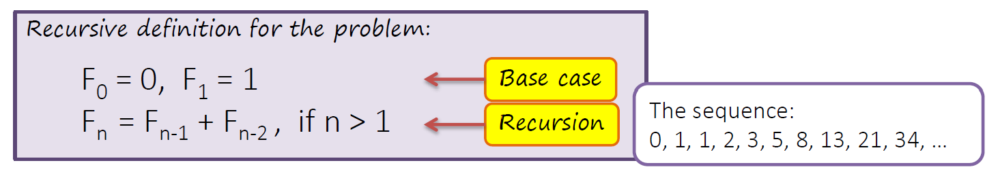
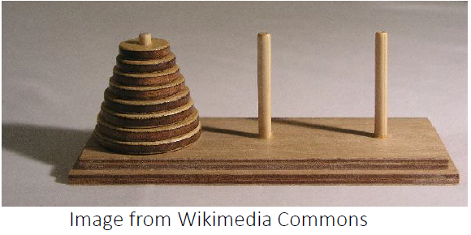

# C++ Notebook

## Contents

- [Preprocessor](#Preprocessor)
- [Main Function](#Main-Function)
- [Namespace](#Namespace)
- [Print in Console](#Print-in-Console)
- [Loop (Iteration)](#Loop)
- [Accept Input](#Accept-Input)
- [Array](#Array)
- [Vector](#Vector)
- [Constant](#Constant)
- [Struct](#Struct)
- [Class](#Class)
- [File IO](#File-IO)
- [Display Manipulator](#Display-Manipulator)

## Preprocessor<a name="Preprocessor"></a>

The preprocessor in C++ will run before the codes go into the compilor. It will remove comments and include dependencies/packages.

### Include dependencies

```
#include <iostream>
#include <string>
```

## Main Function<a name="Main-Function"></a>
- Codes to run when the programme starts.
- Returns 0 if the programme runs successfully.

```
int main() {
    // codes here

    return 0
}
```

## Namespace<a name="Namespace"></a>

To prevent conflict due to same name used in different packages, a namespace is used to distinguish packages.

### Using scope resolution operator

```
std::cout << "Hello World" << std::endl;
```

### Import namespace entirely

```
using namespace std;
cout << "Hello World" << endl;
```

### Import namespace for specific use

```
using namespace std::cout;
using namespace std::endl;

cout << "Hello World" << endl;
```


## Print in Console<a name="Print-in-Console"></a>

`<<` is called the insertation operator.

### Print without starting a new line at the end

```
cout << "Hello World";
```

### Print and start a new line at the end

```
cout << "Hello World" << endl;
```

## Loop (Iteration)<a name="Loop"></a>

### Enhanced `for` loop

Automatically loop over elements in an iterable object:

```
for (double &grade : gradeList) {
    // code here
    // ...
}
```

Note: The current looping element can be passed both by reference or by value. If passed by reference, we can make modification to it. The type need to be specified.

## Accept Input<a name="Accept-Input"></a>

`>>` is called the extraction operator.

### Assign a value to a variable

```
int score {0};
cin >> score;
```

### Accept multiple values at a time

```
int score1 {0};
int score2 {0};

cin >> score1 >> score2;
```

If the user type `100 98` and hit `enter`, `score1` will be `100` and `score2` will be `98` (the keyboard activities will be fed into a buffer, and then extracted character by character).

### Read line as string

```
#include <iostream>
#include <string>

using namespace std;

int main() {
    string strA;
    getline(cin,strA)
}
```

## Array<a name="Array"></a>

- The size need to be specified for an array.
- There will be no bound checking. If there is only 5 members in an array, `arr[5]` will return garbage data.

### Create an array

```
// set the size to be 40, initialize all values to be 0
int testScores [40] {};

// set the size to be 5, and initialize values accordingly
string grades [5] {"A+","A","A","A+","A"};
```

### Retrieve from array

```
cout << "First grade: " << grades[0] << endl;
```

## Vector<a name="Vector"></a>

### Create vector

```
#include <vector>
#include <string>

using namespace std;

vector<int> testScores {};

// initialize first 5 members to "A+"
vector<string> grades (5,"A+");
```

### Retrieve from vector

```
string firstGrade = grades.at(0)
```

If we use `at()` method, there will be bound checking. If the index is out of bound, an exception will be thrown.

### Add to vector

```
grades.push_back("A");
```

## Get vector size

```
grades.size();
```

### 2-D vector

Create 2-D vector

```
vector<vector<int>> studentScores {
    {98,100,96,90,89},
    {90,92,97,93,86}
};
```

Retrieve from 2-D vector

```
int firstStudentFirstGrade = studentScores.at(0).at(0);
```

## Constant<a name="Constant"></a>

A constant is a variable which the value could not be modified once initialized.

```
const int daysInYear = 365;
```

## Struct<a name="Struct"></a>

A struct is a collection of different variables, they can have the same or different types.

```
struct Account {
    double balance;
    string account_holder;
    string account_number;
};
```

Note: `;` at the ending curly brace of struct declaration is required.

In `C++`, a struct can contain not only member variables, but also member methods:

```
struct Account {
    double balance;
    string account_holder;
    string account_number;
    double interest_rate;

    double getInterest() {
        return balance * interest_rate;
    }
}
```

Additionally, you can use this to declare member method:

To be written inside the struct:

```
double getInterest();
```

To be written outside the struct:

```
double Account::getInterest() {
    return balance * interest_rate;
}
```

`::` is the scope resolution operator.

## Class 

### Class declaration
```
class Point {
    public:
        double getX() { 
            return x;
        }
        double getY() { 
            return y;
        }
        void setCoord(double s, double t) {
            x = s;
            y = t;
        }
        double distance(Point & p);
        void translate(Point & p);

    private:
        double x;
        double y;
}
```

Normally, member methods are made `public` while member variables are made `private` to avoid unexpected manipulation.

### Use classes from separated file

Classes are stored in `account.h` file.

At the beginning of `main.cpp` file, add this line:

```
#include 'account.h'
```

## File IO<a name="FILE-IO"></a>

`fstream` package need to be used.

```
#include <fstream>
```

### Write to file

```
ofstream fout; // create output stream
fout.open("data1.txt");

if(fout.fail()) {
    // if output stream fails, fout.fail() will return true
    cout << "Error in file opening" << endl;
    exit(1);
}
```

```
string outputStr = "Hello World";
fout << outputStr << endl;

fout.close();
```

Append mode:

```
fout.open("data2.txt",ios::app);
```

Use string variable as parameter in `open()` method:

```
fout.open(filename.c_str())
```

That's because `open()` only accepts C-string, not `string` object.

### Read from file

```
ifstream fin;
fin.open("data3.txt");

if(fin.fail()) {
    cout << "Error in file opening!" << endl;
    exit(1);
}
```

```
string x;
while(getline(fin,str)) {
    // keep reading from the file until EOF is reached
    cout << x << endl;
}
```

### Extraction from string

The `sstream` library need to be used.

```
#include <sstream>
```

```
string line = "apple orange banana";
string word;
istringstream line_in(line); // create string input stream

while(line_in >> word) {
    cout << word << endl;
}
```

The output of this program will be:

```
apple
orange
banana
```

## Display Manipulator<a name="Display-Manipulator"></a>

Display manipulators are used to set the format for the output in the screen. It is just for display purpose, the original data/variable will not be changed.

They are under the `std` namespace.

### `showpoint`, `fixed` and `scientific` manipulator

```
double e = 12.0
cout << showpoint << e << endl
```

Output: `12.0000`

```
double f = 0.135;
cout << fixed << f << endl;
cout << scientific << f << endl;
```

Output:

```
0.135000
1.350000e-01
```

Note: once the display manipulator is activated, all `float` and `double` nunbers will be formatted.

To stop the effect:

```
cout.unsetf(ios_base::floatfield);
```

### `setprecision` manipulator

Set decimal places to display.

`iomanip` library need to be imported.

```
#include <iomanip>
```

```
double b = 12.6587452;
cout << fixed << setprecision(2);
cout << b;
```

Note: `setprecision` need to be jointly used with `fixed` or `scientific`.

### `setw` and `setfill` manipulator

`iomanip` library need to be imported.

```
int x = 5;
int a = 3;
cout << setfill('*');
cout << setw(5) << x << setw(8) << a << endl;
```

Output:

```
****5*******3
```

Explaination:

This the width of `5` will be 5 spaces, with `5` aligned to the right (4 spaces padded before `5`). All unused spaces will be set to `*`.

### `left` and `right` manipulator

```
int x = 5;
cout << left;
cout << setfill('-');
cout << setw(5) << x << endl;
```

Output:

```
5----
```

## Recursion<a name="recursion"></a>

Recursion means a problem can be solved by dividing it to a smaller version of itself. 

Sometimes, recursion is easier for the developer to write and understand. However, it usually runs slower and use more memory than an equivalent iteration.

If the chain of recursive calls is excessively long, `stack overflow error` may occer (computation is out of memory).



Code:

```
int factorial(int num) {
    if (num == 0) {
        return 1; // base case
    }
    else {
        return num * factorial(num - 1); // general case, reduce to n - 1
    }
}
```

Properties for a recursion:

- Have one or more base case(s)
- The general cases must be able to reduce to base case

Conditions to avoid infinite recursion:

- Recursion called are smaller than the previous one
- There is one or more base case(s) without using recursive calls to terminate the recursion

### Example: Greatest common divisor (Euclidean algorithm)

Reference [Euclidean Algorithm](https://zh.wikipedia.org/zh-tw/%E8%BC%BE%E8%BD%89%E7%9B%B8%E9%99%A4%E6%B3%95)

Code:

```
int gcd(int x, int y) {
    if (y == 0) {
        return x;
    }

    else {
        return gcd(y, x%y);
    }
}
```

### Example: Fibonacci sequence



Code:

```
int fib(int num) {
    if (num < 2) {
        return num; // base cases: 0 and 1
    }
    else {
        return fib(num - 1) + fib(num - 2); // general case
    }
}
```

### Example: Palindrome

Check whether a string is symmetric from the center.

Code:

```
bool is_palin(string s) {
    if (s.length() < 2) {
        return true; // base case, when there is only one or no character in the string
    }
    else {
        return (s[0] == s[s.length()-1]) && is_palin(s.substr(1,s.length()-2)); // check whether the first character equals to the last character. If not, directly return false. Otherwise, continue to work on the substring.
    }
}
```

### Example: Tower of Hanoi



- Move the entire stack of circular disks to another rod. Two rods are empty at the beginning.
- Only one disk may be moved at a time.
- Removed disk must be placed on one of the rods.
- No disk may be placed on top of a smaller disk.
- Question: how many steps do we need if there are `n` disks on the original rod?

Code:

```
void move(int n,char src,char des,char tmp) {
    if (n == 1) {
        cout << "Move disk from " << src << "to " << des << endl;
    }
    else {
        move(n-1,src,tmp,des);
        move(1,src,des,tmp);
        move(n-1,tmp,des,src);
    }
}
```
